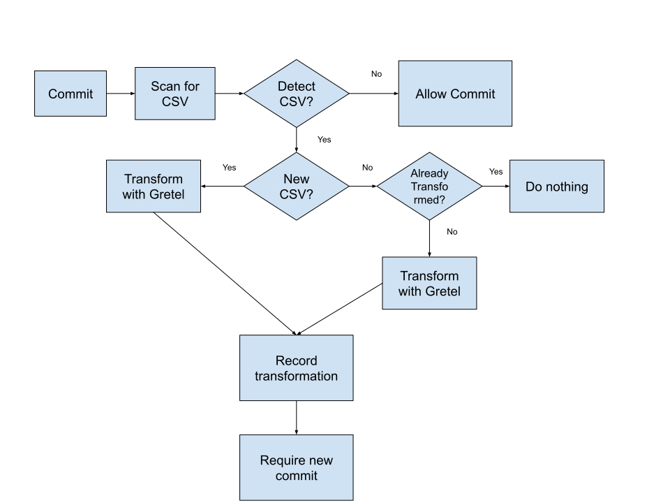

# Gretel PII Transform Pre-Commit Hook
This project is an example of using Gretel's PII Transform tool paired with Git Hooks to automatically detect csv files with potential PII that are being commited to git by mistake. The tool will then transform and replace the original CSV files to ensure PII isn't linked

## Usage

### On First Clone
When you first clone this repository, run the following command:
`cp pre-commit .git/hooks`

Pre-Commit Hooks aren't tracked in git, so if an update is made to the hook you'll need to copy the hook again.

### Setting Up Your Gretel Project
In order to use this pre-commit hook, you'll need to setup a [Gretel](https://gretel.ai/) project. 

When creating this project you should select the Transform option. You'll need to upload a dataset for the model to train on and set the configuration. For this example the default configuration is sufficient, but if you have different needs you can modify it. For more information see the [documentation](https://docs.gretel.ai/transforms/transforms-model-configuration).

Once you have done this you need locate the name of your Project (found under Settings) and the UID of the model (found next to the model name). You'll need these for environment variables.

### Environment Variables
The git hook can either read the necessary Gretel configuration from environment variables. 
You need to set the following environment variables:

* `PROJECT_NAME` - The name of your Project in Gretel = os.getenv("GRETEL_PROJECT_NAME", None)
* `MODEL_ID` - The ID of the model to run the Transform against
* `GRETEL_TOKEN` - Your Gretel API Key, found in your Gretel Dashboard

If you don't provide any of these, the commit script will prompt you for them.

### Workflow
The hook is 2 parts. The bash script `pre-commit` that executes a more intricate python
script `pre_commit.py`. The hook creates `.gretel_transforms.json` after it transforms a file.
This file contains the name and the sha256 of the file. It is used on any subsequent runs
to check to see if the data file has been altered in anyway. If it has, it will perform another
transform.

1. On commit, the hook will check the entire repository for any `.csv` files. 
1. The hook will then make an attempt to open `.gretel_transforms.json` and see if a
transformation has been done in the past. It does this by calculating the sha256 of 
the file and comparing it to the record.
    1. If the sha's match, the data file hasn't been changed and no action needs to be taken.
    1. If the sha's don't match, the file has been changed and the data will be transformed.
1. If a file is detected and not found in `.gretel_transforms.json`, then the file has
never been transformed. The file will then be transformed and it's sha will be added to the file.
1. If a file has been transformed, the commit will be rejected and the user will be prompted to
re-add the files and make the commit again. 

### Disabling the Workflow
If you wish to turn the pre-commit hook off at any time you can either delete
`.git/hooks/pre-commit` or rename the file.
